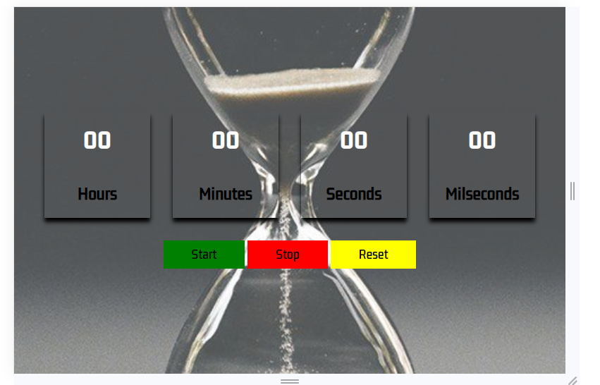

# StopWatch

This project illustrates a simple dynamic stopwatch designed using HTML, CSS, and Vanilla JavaScript.

## Description

The StopWatch project provides a dynamic and interactive stopwatch that allows users to measure time in hours, minutes, seconds, and milliseconds. It features start, stop, and reset buttons for convenient time tracking.

## Table of Contents

- [Screenshots](#screenshots)
- [Features](#features)
- [How to Use](#how-to-use)
- [Project Structure](#project-structure)
- [Stopwatch Functionality](#stopwatch-functionality)
- [Development](#development)
- [License](#license)
- [Author](#author)

## Screenshots

1. Screenshot 1

2. Screenshot 2

## Features

- Real-time updating of hours, minutes, seconds, and milliseconds.
- Start button to initiate the stopwatch.
- Stop button to pause the stopwatch.
- Reset button to clear and restart the stopwatch.

## How to Use

1. Open the `index.html` file in a web browser.
2. Observe the stopwatch interface displaying hours, minutes, seconds, and milliseconds.
3. Click the "Start" button to initiate the stopwatch.
4. Click the "Stop" button to pause the stopwatch.
5. Click the "Reset" button to clear and restart the stopwatch.

## Project Structure

- `index.html`: HTML file containing the structure of the StopWatch.
- `style.css`: CSS file for styling the StopWatch interface.
- `script.js`: JavaScript file for creating the stopwatch functionality.

## Stopwatch Functionality

The stopwatch dynamically updates in real-time, allowing users to track time accurately. It features start, stop, and reset buttons for convenient time measurement.

## Development

To contribute to the project or make modifications, follow these steps:

1. Clone the repository.
2. Make changes to the HTML, CSS, or JavaScript files.
3. Test the changes in a web browser.
4. Submit a pull request if you would like to contribute your modifications.

## License

This project is licensed under the MIT License - see the [LICENSE.md](LICENSE.md) file for details.

## Author

- **Hosea Nganga**

Feel free to explore, use, and contribute to this CountDown App project!
